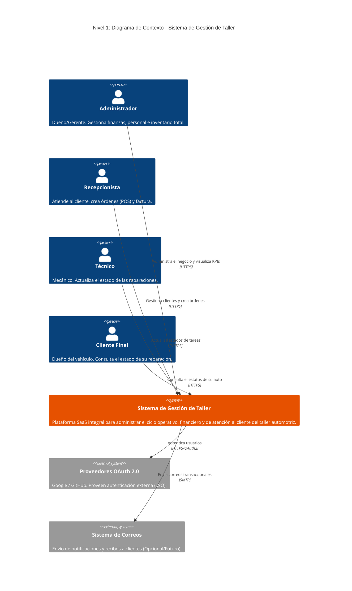
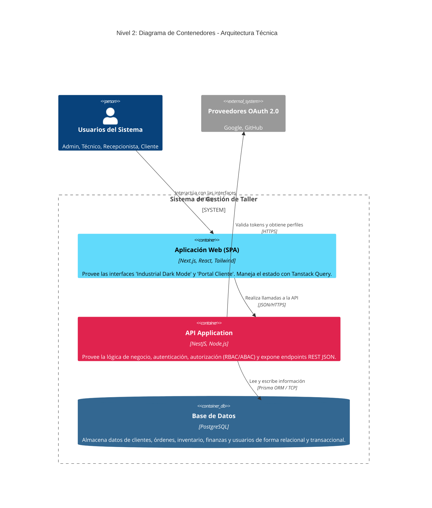
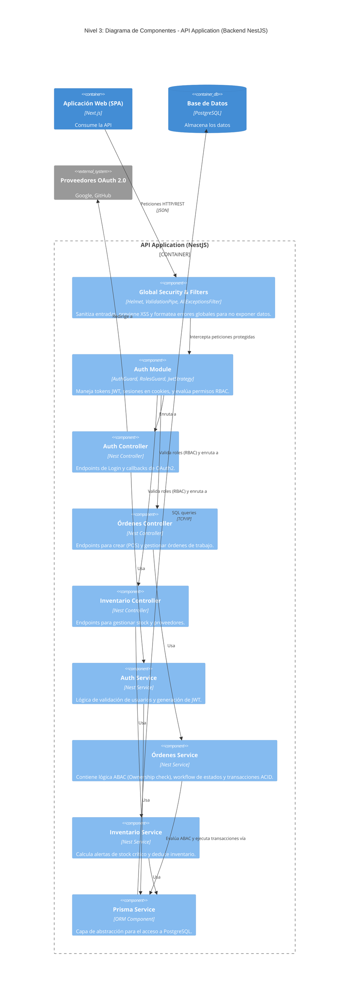

# Arquitectura C4 - Sistema Integral de Gestión de Taller

Este documento describe la arquitectura del sistema usando el modelo C4 hasta el nivel 3 (Componentes), en formato Mermaid compatible con GitHub.

## Nivel 1: Contexto del Sistema

## Nivel 2: Contenedores

## Nivel 3: Componentes (Zoom en API Backend NestJS)

## Uso en la entrega

- En GitHub, este archivo renderiza los diagramas Mermaid automáticamente.
- Para Word/PDF, copia cada bloque en Mermaid Live Editor y exporta como PNG o SVG.
